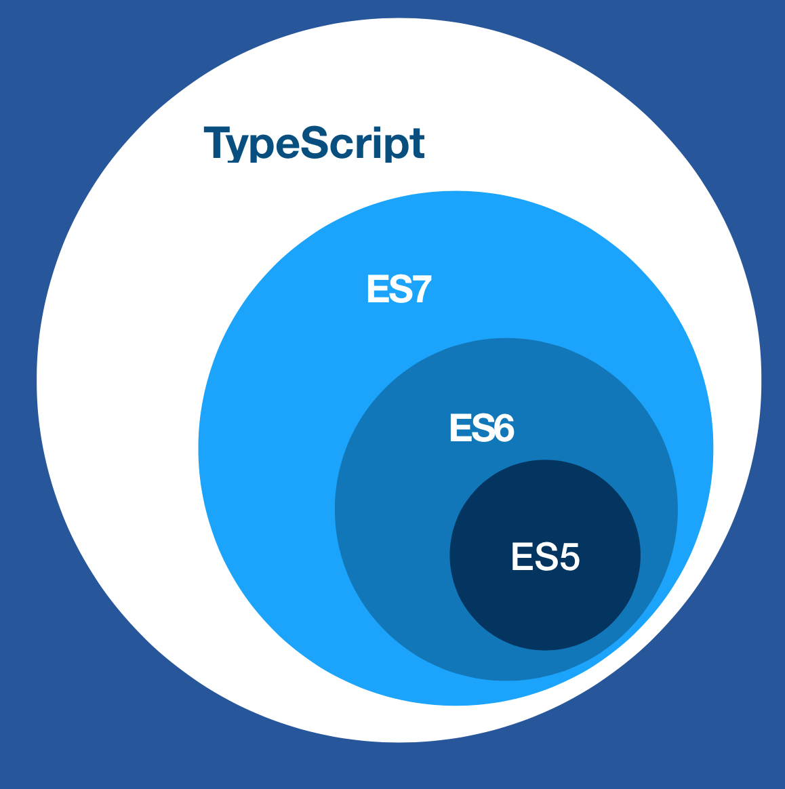

# typescript

> typescript 是 js 的超集



## 全局安装 typescript

``` bash
npm install -g typescript
```

## 编译

``` bash
tsc index.ts
```

## vue-property-decorator
+ @Component
+ @Prop
+ @PropSync
+ @Watch
+ @Emit
+ @Ref
+ @Provide
+ @ProvideReactive
+ @Inject
+ @InjectReactive
+ @Model